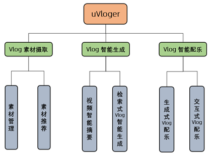
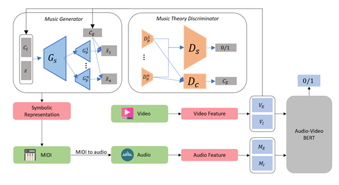
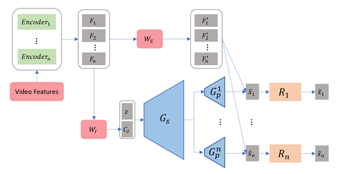
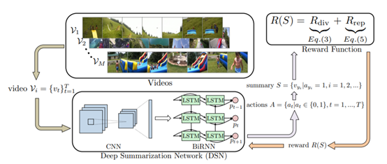
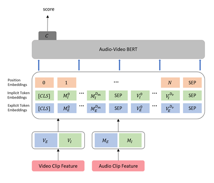

# 可行性分析报告-UVLOGER 
# 基于深度学习的视频配乐自动剪辑系统 

## 1 引言
### 1.1 编写目的  
可行性分析报告是为“UVLOGER”开发的可能性、可行性、必要性提供论据，为开发人员进行系统总体规划设计及具体实施开发工程提供必要的参考资料，在系统开发完成后期为系统的测试、验收提供帮助。预期读者是从事“UVLOGER”开发的相关人员。 
### 1.2 项目背景
本项目名称为“UVLOGER”。系统功能主要包括：视频配乐,基于给定音乐的Vlog生成,Vlog智能剪辑生成,交互式配乐.uVloger旨在通过深度学习技术，降低Vlog素材摄取、Vlog制作及视频配乐的操作成本、专业门槛，让用户在“零乐理、零剪辑知识”的基础下，可以轻松、高效地制作出个性化的Vlog作品，在这个全民Vlog的时代，用独特的Vlog体现用户个人独特性。
## 2 项目概述
### 2.1 要求
“基于生成的视频配乐”创新性技术也将为游戏、广告等大需求创作场景、高成本的提供新技术解决方案。
同时uVloger将多模态素材统一整合，体现万物互融理念，构造碎片信息分享的社交链，为用户个性化精准推荐多模态素材，用以改良用户Vlog质量，提供优质视频素材摄取渠道。从而打造由素材摄取、管理，到Vlog生成以及配乐的一站式，一体化Vlog服务。
#### 2.1.1 功能
视频配乐,基于给定音乐的Vlog生成,Vlog智能剪辑生成,交互式配乐
#### 2.1.2 性能
业务响应时间：1-2秒之内
数据库更新处理时间：5秒之内
数据转换与传输时间：30秒之内
运行时间：7*24小时
#### 2.1.3 系统的输出
为给定视频人工智能地生成配乐,根据给定音乐，裁取视频素材片段，生成Vlog,配乐生成过程当中，使用户从多义性视频解释当中选择最为贴近用户自身理解的视频理解，根据用户个人理解生成乐句
#### 2.1.4 系统的输入
- 用户导入素材
- 用户导入配乐
- 根据多模态素材特征、用户素材特征生成的用户画像
#### 

#### 2.1.5 可靠性和安全性需求
- 容错性:随机测试错误密码，用户名，无效文件等输入 观察系统是否能判断数据的有效性，是否能对错误操作进行准确清晰的提示和处理 
- 安全性: 检查密码的存储方式，留痕功能，权限分配方式 检查密码是否以密文方式存储，是否保留操作日志以及权限分配是否合理，对于权限路由A，只能由用户群体G访问
#### 2.1.6 完成期限
本项目的完成期限为2020年5月底.
### 2.2 项目基本目标
所建议的系统的开发目标应考虑以下几个方面：
- 可维护性：对于系统的出现的故障可以清晰找到故障出处，便于程序员修正漏洞。
- 可使用性：UI整体较为简洁、美观，使用体验清爽。同时对于接口调用异常做一定的包装处理，要求系统对用户有一定的友好性。
- 安全性：保证系统安全，对于可能会存在的恶意接口调用、XSRF跨站请求、DDoS恶意攻击有一定的预防、警惕机制；保证数据安全，从不存储用户的明文密码、避免Cookie中存储敏感用户数据。
- 可移植性：对于除快应用入口外的其他入口具有可移植方便性，便于商业发展。
### 2.3 条件、假定和限制
####  2.3.1 所建议系统的运行寿命的最小值
系统运行寿命的最小值应为10年。
#### 硬件、软件、运行环境和开发环境方面的条件和限制  
- 硬件资源 GPU资源 CPU资源
- 数据资源 YouTube-8M Dataset(爬取并筛选15, 000支MV数据) Lakh MIDI Dataset(包含170, 000 + MIDI文件数据集)
- 软件资源 Python及相关深度学习库 MySQL、MongoDB、Redis等数据库系统软件
## 3 对现有系统的分析  
### 3.1 视频平台现状
视频流量如今占领互联网流量高地，2019年我国短视频用户规模达8.2亿，Vlog用户达2亿。4G/5G网络的加持，让用户得以通过视频体裁与社交网络表达个性、追求新知。
Vlog平台相比短内容，更容易使用户对创作者产生强烈认知，从而体现创作者价值。然而Vlog平台近来反映着一种技术焦灼，即用户和内容需求急速增长，而Vlog内容的制作周期长、成本高、宣发推广慢。
究其原因，Vlog制作流程当中，存在如下成本：
1.	Vlog素材摄取的时间成本
Vlog类视频需要录制较多素材，冗余信息多，导致素材管理、剪辑耗时费力。普通用户摄影技术及设备有限，难以获得优质Vlog素材。
2.	Vlog剪辑的操作成本、学习成本
视频剪辑软件具有学习成本，操作成本。此外针对大量Vlog素材的剪辑耗时费力。
3.	Vlog配乐的专业成本
普通用户由于缺少作曲知识，无法为Vlog创作配乐。而使用音乐素材的普通用户，也难以为视频选择节奏、风格契合Vlog的乐曲。短视频平台往往基于检索地帮助用户挑选已有乐曲，但多数情况下与视频风格、节奏契合度有限，可解释性差；同时素材大量复用，难以体现用户作品的独特性。
### 3.2 现存解决方案
目前市场上针对这些局限性，已有的最新、最优解决方案包括：
1.	“基于检索的视频智能配乐”：快手、微信朋友圈等短视频服务，提供基于检索的配乐功能，即为用户短视频检索现有音乐作品作为配乐。音乐往往无法在节奏或风格上完全契合视频，可解释性差，素材复用严重。音乐经常会在乐句中间截断，丧失了乐句本身的完整性。
2.	“基于创作的视频配乐”：目前业界并没有成熟产品，由于“视频-符号音乐”数据集的缺失3，学界目前主要方法是根据视频特征，及人为设定的作曲规则创作。借助作曲规则的约束，尽管可以创作出契合视频的音乐，但是由于较强条件的限制，生成的效果较为死板，缺乏多样性。
3.	 “音乐生成”技术：符号音乐本身具有序列性，自然语言处理当中的深度学习技术同样被成功应用在了音乐生成当中。工业领域当中，Jukedeck、AIVA等人工智能音乐服务商，可以根据用户设定的风格、节奏、调性等信息生成多轨道音乐，具有一定可听性。

## 4 所建议的系统  
### 4.1 对所建议的系统的说明
所建议的系统是基于B/S+C/S结构的混合服务系统,通过快应用与h5的结合,达成能在网页上与安卓手机上实现相似的用户体验,做到多平台的体验.
### 4.2 改进之处  
针对上述局限性，我们将使用人工智能技术，以移动端快应用的形式呈现 “智能Vlog生成”、“视频智能配乐”两大服务。

### 4.3 处理流程和数据流程

##  5 可行性分析
### 5.1 技术条件可行性分析

此部分将给简述uVloger所采用的深度学习技术可行性。

####  5.1.1   创新性的生成式视频配乐

针对“视频-符号音乐”数据缺失的问题，uVloger设计了创新性的生成式视频配乐解决方案。设计生成式对抗网络1架构，以实现符号域3生成、音频域判别。MIDI5到音频格式转换，以及由MIDI得到的音频（audio-from-MIDI）在音频任务实验[1]中的有效性，为我们的模型提供了设计灵感。

如图所示的模型整体架构图。我们将判别器分为“契合性判别器”用于检测视频与音频的契合度；以及“音乐性判别器”，用于检测所生成多轨道音乐的和谐、对位性质。

在“契合性判别器”的设计当中，uVloger提出了Audio-Video BERT进行音频、视频的跨域联合分布学习。我们将首先完成Audio-Video BERT预训练及二分类任务的finetune再将其加入应用于整体架构训练，即uVloger为多任务架构。

生成器部分，uVloger采用多个子生成器用于各轨道生成，相应的“音乐性判别器” 部分也具有多个子判别器。基于此设计，uVloger得以创作多轨道符号音乐。此外，我们在判别器当中加入了“条件判别器”，检测作为条件输入生成器的视频特征，是否确切影响了各轨道生成器所产生的符号乐高层表示。

本技术的备选方案设计基于Transformer[2]技术，加以乐理限制。视频契合性的baseline同样基于乐理及特定视频-音乐映射规则制定[3]，音乐性参照方案源于MuseGAN[4]的多轨道符号乐器生成。

#### 5.1.2  创新性的交互式视频配乐

对于此问题uVloger首要解决的任务是多语义视频特征的可解释性。为此我们使用原视频特征输入，完成多个视频理解任务预训练，通过多个编码器提取出特征空间的不同语义所在空间。

如图所示，经过数个编码器，我们提取出多种预先设定的可解释性特征。视频特征经过用户交互获得的加权矩阵，作为条件（condition）输入生成器。

整体架构是基于5.1.1当中的多轨道生成器扩充实现。为了保证输入的特征条件确切影响了生成器，判别器基于InfoGAN[5]对生成器输出解码判定。

### 5.1.3 视频摘要技术

uVloger通过视频摘要技术，从冗长的用户视频素材当中挑选出关键片段，自动修改构图、加入过场、剪辑合成Vlog作品。

如图所示，uVloger基于目前SoTA技术，采取端对端的强化学习，训练深度摘要网络DSN[6]。DSN以视频作为输入，使用二值序列的动作集来确定选中的视频部分。并计量动作得到的回报（reward），以评估摘要方案的多样性、代表性。

#### 5.1.4 检索式视频配乐

检索式视频配乐的服务是指，用户给定所需要使用的配乐，uVloger将根据配乐特征，检索用户视频素材，自动截取契合配乐的视频片段，生成Vlog作品。

由于问题本身的输入是音乐，且音乐本身结构性较强，这里我们在音乐频谱图上应用利用卷积神经网络CNN，进行音乐结构分析及区间划分，并截取对应的视频片段，组成一组音频-视频片段数据。

接下来对数据对提取音频、视频特征，并且建立联合分布模型。

相关工作指出通过混合高斯模型GMM完成视频特征、音频特征上的联合分布建模，通过期望最大化算法（EM）进行极大似然估计，用以计算混合参数。混合高斯模型中的每个子模型将用于描述音频-视频的一组联合规则。此方案将作为uVloger检索配乐的baseline方案进行考查。

同时我们设计的原创方案，基于5.1.1当中的Audio-Video BERT模块，并通过修改输出层finetune实现，如图所示，针对生成式对抗网络设计的二分类判别器输出，在这里修改为概率输出作为音频、视频契合度评分。

### 5.2 经济可行性分析
uVloger市场可行性首先来源于市场环境和技术、理念的先进性，而更为重要的在于uVloger如何引流。  
根据Aurora Mobile以及QuestMobile统计分析，我国短视频用户规模超过8.2亿，短视频行业完成前期流量积累， QuestMobile认为短视频“行业红利期已过”。2019年3月，短视频行业MAU同比增幅只有一年前的1/3，环比甚至出现了过去12个月里的第一次下滑。  
抖音和快手同时在广告、直播打赏、电商带货、游戏等领域发力。其原因在于用户价值的提升才是加速商业化变现的关键。  
然而过短的内容不利于用户对创作者形成强烈认知，Vlog则可以在一定程上改变这种局面。所以目前，众多短视频平台转而大力支持Vlog。2019年下半年，抖音、百度、B站皆投入大量资金支持Vlog创作。  
然而Vlog相较于短视频，制作的周期更长，且操作成本更高。对于Vlogger要求及门槛也更高。  
针对此种局面，uVloger并未选择需求接近长尾的短视频领域，而是针对Vlog生产中的局限性提出解决方案。通过智能技术降低Vlog创作成本，体现用户价值。
低门槛、低操作成本的创作允许用户更轻松地展现自我，表达自身独特性。智能技术作为uVloger相比其他Vlog平台的技术创新，也将是吸引用户的关键。

### 5.3 参考文档

[1]   Cataltepe, Z., Yaslan, Y., & Sonmez, A. (2007). Music genre classification using MIDI and audio features. Eurasip Journal on Advances in Signal Processing

[2]   Huang, C.-Z. A., Vaswani, A., Uszkoreit, J., Shazeer, N., Simon, I., Hawthorne, C., … Eck, D. (2018). Music Transformer.

[3]   Prisco, R. D. , Malandrino, D. , Zaccagnino, G. , & Zaccagnino, R. . (2016). An Evolutionary Composer for Real-Time Background Music. Evolutionary and Biologically Inspired Music, Sound, Art and Design. Springer International Publishing.

[4]   Dong, H. W. , Hsiao, W. Y. , Yang, L. C. , & Yang, Y. H. . (2017). Musegan: multi-track sequential generative adversarial networks for symbolic music generation and accompaniment.

[5]   Chen, X. , Duan, Y. , Houthooft, R. , Schulman, J. , Sutskever, I. , & Abbeel, P. . (2016). Infogan: interpretable representation learning by information maximizing generative adversarial nets.

[6]   Zhou, K. , Qiao, Y. , & Xiang, T. . (2017). Deep reinforcement learning for unsupervised video summarization with diversity-representativeness reward.

## 6 社会因素方面的可行性
### 6.1 法律方面的可行性
    所建议系统的研制和开发都选用正版软件，将不会侵犯他人、集体和国家的利益，不会违反相关的国家政策和法律。 

### 6.2 操作方面的可行性
    本系统的研制和开发充分考虑用户工作流程、计算机操作水平等，尽可能提供更人性化、直观的界面，满足用户要求。系统的操作方式在用户组织内可行。 

## 7 可行性的结论
经上述可行性分析，系统的研制和开发可以立即开始进行。 
