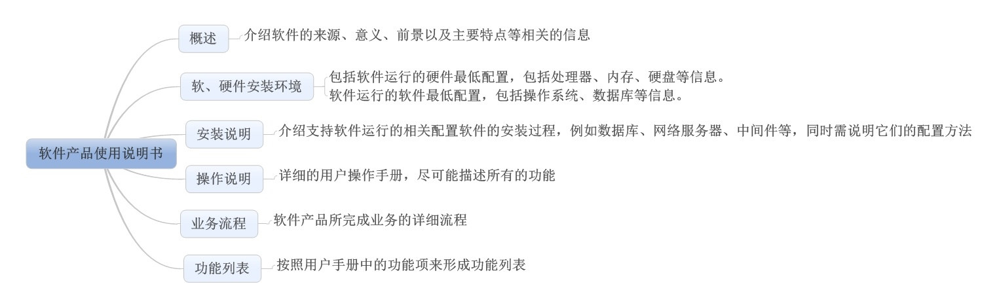
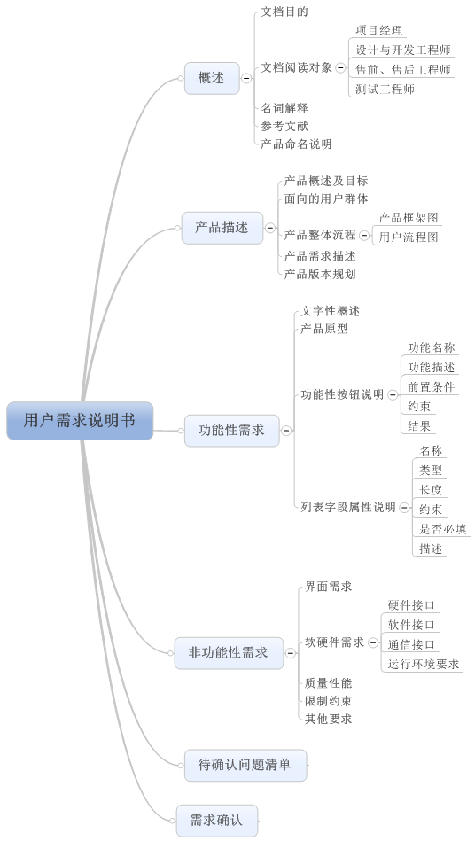
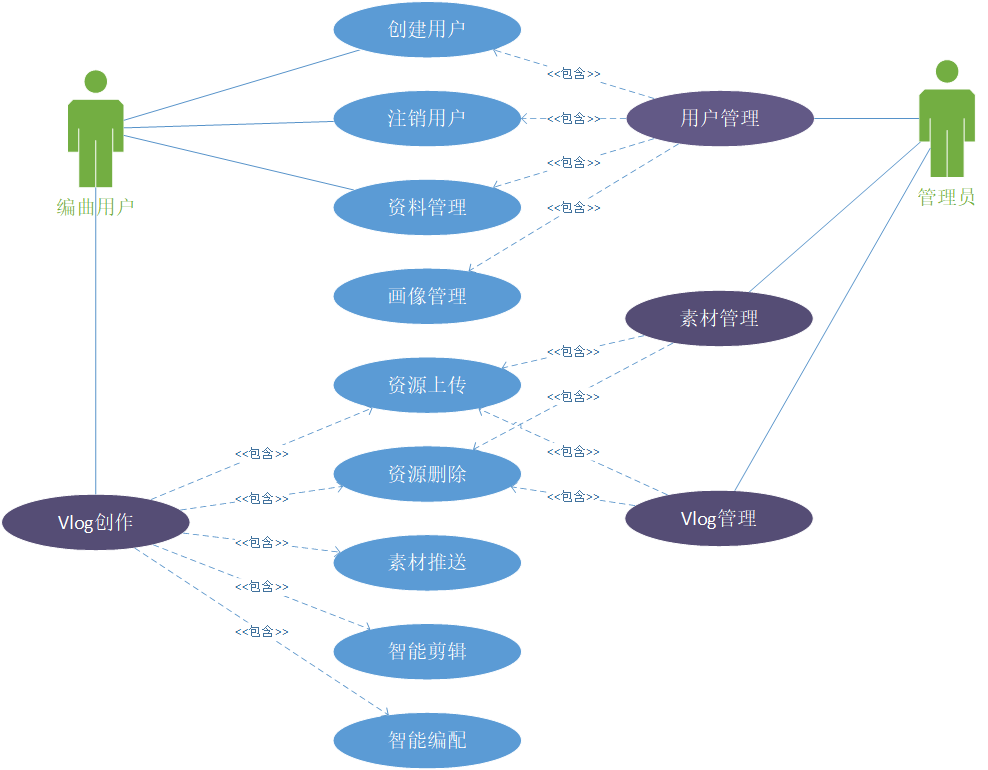

# 共享文档

> ==从表格标记自己的部分，比如gdc要用某一段，为了防止cy或者yzh也用到，所以在表格里标记一下自己的名字（或者简写，保证唯一能让git冲突就可）。==
>
> 
>
> COMMON部分感觉都一样，直接复制就可，不用标记
>
> 
>
> 食用愉快：）

| name | id   |
| ---- | ---- |
| 1-1  | zx   |
| 1-2  | gdc     |
| 1-3  |  cy    |
| 1-4  |  yzh    |

## TEMPLATE

实验目的：
  1. 学习最新软件需求规格说明SRS文档的要求和特点
  2. 练习用各种动态建模等工具对所负责的系统进行建模，与用户沟通。
  3. 继续完善自己项目的SRS。
  4. 记录项目及小组的工作进度。

要求：
1. 每组组长（可轮换制），负责小组分工、讨论、汇总。
2. 小组工作方式，应合理分工，将小组工作文档、进度等文档都保存到共享平台上。
3. 合理评价(互评）：根据贡献（参与小组讨论积极性、完成分工工作、提交文档质量、时间等）大小按1-5评分。

实验内容：
### 1.

> 下载课程网站\实验\参考资料\中的《掌握需求过程(第3版)》学习，对比其附录A和国标SRS的模板，分析有什么不同和特点。
>
> 选择其中必要的部分，补充进自己项目的SRS。

==**COMMON**==

经过小组讨论与阅读，我们列出《掌握需求过程（第3版）》附录中的软件需求说明如下

项目驱动 373
1．项目的目标 373
2．利益相关者 374
项目限制条件 377
3．强制的限制条件 377
4．命名惯例和定义 381
5．相关事实和假定 382
功能需求 383
6．工作的范围 383 7．业务数据模型和数据字典 383
8．产品的范围 386
9.功能需求 387
非功能需求 389
10.观感需求 389
11．易用性和人性化需求 390
12．执行需求 393
13．操作需求和环境需求 397
14．可维护性和支持需求 399
15．安全性需求 400
16.文化需求 403
17.法律需求 404
项目问题 405
18.开放式问题 405
19．立即可用的解决方案 405
20．新问题 406
21.任务 408
22.迁移到新产品 409
23.风险 410
24.费用 411
25.用户文档和培训 411
26.后续版本需求 412
27.关于解决方案的设想 413

==COMMON END==

而该软件需求的提纲和国标软件需求说明的区别主要有

==1-1==

法律需求

法律需求是指软件需要符合法律要求，以避免将来引起延迟、诉讼和法律费用。

考虑咨询律师来帮助确定法律需求。是否存在必须保护的版权？另外，是否有一些竞争对手拥有一些版权，你可能 会违反？是否要求开发者没有看过竞争对手的代码，或没有为竞争对手工作过？

如同最近的热门问题，4 月 15 日下午，破解百度网盘的 Pandownload 开发者被捕的消息引发热议。

作为pandownload的开发者，侵犯了百度的合法权益，所以即使百度的用户体验较差，但是它依然有权利对pandownload的开发者提出诉讼。而这也引发了一部分网民对百度的声讨。

所以对于pandownload的作者来说，他开发的软件是违法法律的需要承担相应的法律风险。

但是对于百度来说，百度网盘对于盗版影视资源的传播也起了非常大的帮助的作用，所以百度也是有着相应的法律风险的。但是只是由于当前我国对于这部分的法律法规不够完善，或者由于百度的体量问题，在这些问题上付出的代价九牛一毛，所以暂时没有收到对应的制约。

那么对应的，我们的软件也需要考虑到与百度类似的问题。Vlog的版权归属，如何判定生成的结果与训练集之间是否造成了版权的纠纷呢？这些问题都需要去咨询相应的专业人士，来为我们的软件和软件开发人员提供相应的保护。

==1-1 END==

==1-2==

用户文档和培训

1、为了UVloger完成后提供给用户一个安装、操作使用说明，提高售后人员的响应，帮助户更好的操作使用产品。而在另一方面，面向小组内部销售、研发、设计等人员，提供给销售理解产品，提供给研发作为开发依据，提供给设计作为设计框架。

除此之外，用户文档还要主要介绍UVloger主要内容与功能。通过对每个功能进行详细的描述，可以让阅读者快速全面地了解该系统的功能。方便客户和需求分析人员之间的沟通，让设计人员、测试人员、开发人员更好的了解用户的需求。

2、文档撰写框架比较软件产品用户手册：

软件需求文档：

3、总结：软件产品使用说明书的背景可参考用户需求文档中产品描述中的产品概述及目标、面向的用户群体；软件产品使用说明书中的业务流程和用户需求文档中的用户流程图基本一致，可根据需要进行相关的扩展。软件产品使用说明书中的操作说明为重点，可结合用户需求文档中的功能性需求说明来尽可能详细的说明软件操作的一般过程。

==1-2 END==

==1-3==

安全性需求

（1）访问安全

指定谁被授权使用该产品（包括功能和数据），以及在什么样的情况下授权， 以及对产品的哪一部分的访问是允许的。举日常中的例子来说：

> 只有直接经理可以看到他的职员的个人记录。
>
> 只有持有当前安全许可证的人才能进入大楼。

是否存在管理层敏感的数据？是否有一些数据是低层用户不希望管理层访问 的？是否有一些过程可能导致损害或可能用于个人获利？是否有些人不应该有权使 用该产品？

避免在这里就提供安全需求的设计解决方案。例如，不要设计一个口令系统。 这里的目标是确定什么是安全性需求。设计将从这些描述中产生。

由于UVloger是一个比较新的领域， 而且我们的人力有限，可能无法完成安全性相关的测试。因此我们考虑寻求帮助。计算机安全是一个高度专业化的领域，在这个领域里，没有正确资质的人将无所作为。我们的产品需要比一般情况更强的安全性，所以考虑安全性咨询。这种咨询不便宜，但安全性不够带来的结果的代价可能将更加高昂。

（2）完整安全

完整安全的目标有两方面：（1）理解对产品数据完整性的预期；（2）指定产品应该怎样 做才能在意想不到的事情发生的时候确保它的完整性，这些事情包括受到外部攻击 或授权用户的无意误操作等。

例如产品应该防止引入不正确的数据；产品应该能防止它们被有意地滥用。

组织机构越来越依赖于他们存储的数据。如果数据产生冲突、不正确，或者消失，可能会给组织带来致命一击。例如，几乎半数的小公司在火灾摧毁了他们的计算系统后破产。完整性需求的目标是防止数据和过程的完全丢失和冲突。

所以在完整安全部分，我们考虑使用带有容灾等措施的云服务器来规避这个问题。使得我们的代码可以防止因一些自然或者认为因素导致数据丢失等问题。

（3） 隐私安全

隐私安全需要指定产品必须做什么来保护产品存储的信息中包含的个人隐私。产品也必须确 保所有关于个人数据隐私的法律都得到遵守。确保产品符合法律，保护顾客的个人隐私。毕竟很少有人会对不保护他们隐私的组 织机构有好感。

举例来说：

> 产品应该在向用户收集信息之前，让他们意识到它的信息操作。
>
> 产品应该向顾客通知它的信息策略的变化。
>
> 产品应该只有在满足组织机构的信息策略时，才能暴露私人信息。
>
> 产品应该根据相关的隐私法律和组织机构的信息策略，对私人信息进行保护

在收集并保存顾客的私人信息时，顾客必须总是能够选择同意或不同意。类似 地，顾客应该能够查看他们的私人数据，如果需要，也能够要求更正这些数据。另外还要考虑私人数据的完整性和安全性——例如，如果保存的是信用卡或者支付宝微信信息等等。

==1-3 END==

==1-4==

立即可用的解决方案

我们需要查看一些可用的解决方案，并总结它们对于需求的适用性。这些讨论不是 要成为替代方案的完整可行性研究，而是应该告诉你的客户，你已经考虑了一些替代方案，并确定了它们与UVloger的匹配程度如何。

（1）对于已经做好的产品

列出应该调查的现有的与UVloger产品，这些产品可作为潜在解决方案。参考针对这些产 品的一些已完成的调查。考虑是否可以购买一个解决方案。

同时也要考虑是否有哪些产品由于效果差或者是竞品关系等等原因导致是一定不能使用的。

（2）可复用组件

描述可能用为UVloger的候选组件，包括采购的组件和公司自己开发的组件。列出可能的组件来源，避免重复发明。

（3） 可以复制的产品

其他相似产品或部分产品的清单，可以合法地复制它们，或很容易对它们进行修改，避免重复发明。尽管一个现成的解决方案也许不存在，但还是可能有些本质上很类似的东西， 可以复制或做些修改，这样会比从头开始的效果好。注意，这种方式可能有危险， 因为它假定作为基础的系统具有良好的品质。

==1-4 END==

### 2.

> 针对所负责项目的不同场景，练习用动态建模（MSC、状态图)、DFD及函数关系、OCL逻辑等工具建模需求，与用户沟通。
> 参考第4章，4.12 皮卡迪里电视广告售卖系统

==COMMON==

在参考课本的皮卡迪里电视广告售卖系统吼，我们用UML创建了一个基本的需求分析图。

==COMMON END==

### 3.

分工协作，用上面的工作补充完善SRS和所负责的系统。

### 4. 

> 记录项目及小组每个人工作的进度、里程碑、工作量的跟踪图或表。每周更新。
> 每人提交自己本周工作报告给组长。组长负责提交小组共同报告和修改后的文档。

